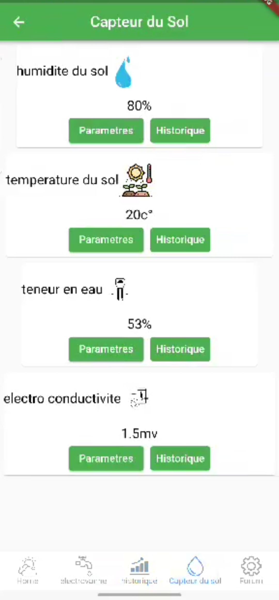
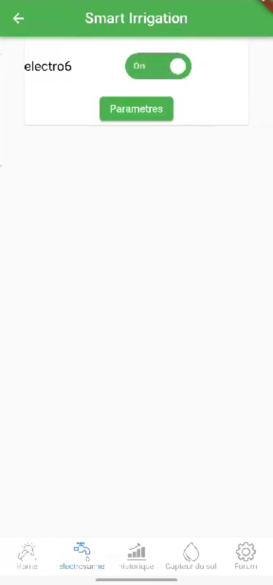

# Smart Irrigation Application

This mobile application is designed for smart irrigation management, created during a voluntary internship. It offers features for managing soil sensors, tracking irrigation history, and controlling solenoid valves.

## Features

- **Soil Sensor Management:** Monitors soil moisture levels in real-time.
- **Irrigation History:** Tracks and displays historical irrigation data.
- **Solenoid Valve Control:** Manages solenoid valves with on/off functionality.

## Technologies Used

- **Frontend:** Flutter
- **Backend:** Express.js
- **Database:** MongoDB

## Screenshots

**Soil Sensor Dashboard**

**Irrigation History**

**Solenoid Valve Control**

